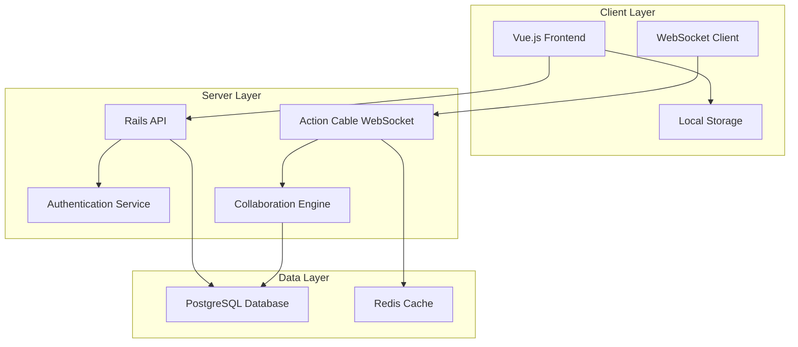

# Design Document

## Overview

The Real-Time Collaboration App is a web-based application that enables multiple users to collaboratively edit notes in real-time. The system uses a client-server architecture with Vue.js frontend, Rails backend, and WebSocket connections for real-time communication. The application implements operational transformation for conflict resolution and supports role-based access control.

## Architecture

### High-Level Architecture



### Technology Stack

- **Frontend**: Vue.js 3 with Composition API, TailwindCSS, DaisyUI
- **Backend**: Ruby on Rails 7 with Action Cable for WebSockets
- **Database**: PostgreSQL for persistent data, Redis for session management and real-time data
- **Real-time**: Action Cable with Redis adapter for WebSocket scaling
- **Authentication**: Rails built-in authentication with session management

## Components and Interfaces

### Frontend Components

#### Core Vue Components

1. **NotesList.vue**
   - Displays user's accessible notes
   - Handles note creation and deletion
   - Shows collaboration status indicators

2. **NoteEditor.vue**
   - Main editing interface with rich text editor
   - Integrates WebSocket for real-time updates
   - Handles cursor positioning and selection tracking

3. **CollaboratorPanel.vue**
   - Shows active collaborators
   - Displays user presence and typing indicators
   - Manages role-based UI permissions

4. **InviteModal.vue**
   - Interface for inviting new collaborators
   - Role selection and permission management

5. **CollaboratorForm.vue**
   - Email input with search functionality
   - User search results dropdown with autocomplete
   - Role selection for invited users

#### WebSocket Client Service

```javascript
class CollaborationService {
  connect(noteId, userId)
  disconnect()
  sendOperation(operation)
  onReceiveOperation(callback)
  onUserJoin(callback)
  onUserLeave(callback)
  onCursorMove(callback)
}
```

### Backend Components

#### Rails Models

1. **User Model**
   - Authentication and user management
   - Has many notes (as owner)
   - Has many collaborations

2. **Note Model**
   - Content storage and versioning
   - Belongs to owner (User)
   - Has many collaborations
   - Tracks document state for operational transformation

3. **Collaboration Model**
   - Join table between User and Note
   - Stores role (owner, editor, viewer)
   - Tracks access permissions and timestamps

4. **Operation Model**
   - Stores document operations for conflict resolution
   - Includes operation type, position, content, and timestamp
   - Used for operational transformation algorithm

#### Rails Controllers

1. **NotesController**
   - CRUD operations for notes
   - Authorization based on user roles
   - Returns note content and collaboration metadata

2. **CollaborationsController**
   - Manages user invitations and role assignments
   - Handles permission updates and access revocation

3. **UsersController**
   - Provides user search functionality for collaboration invites
   - Returns filtered user results based on email/name queries

#### Action Cable Channels

1. **NoteChannel**
   - Handles real-time document operations
   - Broadcasts changes to all connected collaborators
   - Manages user presence and cursor tracking

```ruby
class NoteChannel < ApplicationCable::Channel
  def subscribed
    note = Note.find(params[:note_id])
    authorize_access(note)
    stream_for note
    broadcast_user_joined
  end

  def receive(data)
    case data['type']
    when 'operation'
      process_operation(data)
    when 'cursor'
      broadcast_cursor_position(data)
    end
  end
end
```

## Data Models

### Database Schema

#### Users Table
- id (primary key)
- email (unique)
- name
- avatar_url
- created_at, updated_at

#### Notes Table
- id (primary key)
- title
- content (jsonb for rich text structure)
- owner_id (foreign key to users)
- document_state (jsonb for operational transform state)
- created_at, updated_at

#### Collaborations Table
- id (primary key)
- user_id (foreign key to users)
- note_id (foreign key to notes)
- role (enum: owner, editor, viewer)
- created_at, updated_at

#### Operations Table
- id (primary key)
- note_id (foreign key to notes)
- user_id (foreign key to users)
- operation_type (insert, delete, retain)
- position (integer)
- content (text)
- timestamp (datetime with microseconds)
- applied (boolean)

### Real-time Data Structures

#### Document Operations (JSON)
```json
{
  "type": "operation",
  "noteId": "123",
  "userId": "456",
  "operations": [
    {
      "type": "retain",
      "count": 10
    },
    {
      "type": "insert",
      "text": "Hello World"
    }
  ],
  "timestamp": "2024-01-01T12:00:00.000Z"
}
```

#### User Presence (JSON)
```json
{
  "type": "presence",
  "userId": "456",
  "userName": "John Doe",
  "cursor": {
    "position": 25,
    "selection": {
      "start": 20,
      "end": 30
    }
  },
  "status": "typing"
}
```

## Error Handling

### Client-Side Error Handling

1. **Connection Errors**
   - Automatic reconnection with exponential backoff
   - Queue operations locally during disconnection
   - Display connection status to users

2. **Operation Conflicts**
   - Transform operations using operational transformation
   - Retry failed operations with updated context
   - Provide user feedback for unresolvable conflicts

3. **Permission Errors**
   - Graceful degradation to read-only mode
   - Clear error messages for unauthorized actions
   - Automatic role updates when permissions change

### Server-Side Error Handling

1. **WebSocket Errors**
   - Graceful channel disconnection
   - Cleanup of user presence data
   - Logging of connection issues

2. **Database Errors**
   - Transaction rollback for failed operations
   - Conflict resolution for concurrent updates
   - Data integrity validation

3. **Authorization Errors**
   - Secure error messages without data leakage
   - Audit logging of unauthorized access attempts
   - Automatic session cleanup

## Testing Strategy

### Frontend Testing

1. **Unit Tests (Vitest)**
   - Component logic and state management
   - WebSocket service functionality
   - Operational transformation algorithms
   - User interaction handlers

2. **Integration Tests**
   - Component communication
   - WebSocket connection handling
   - Real-time update propagation
   - Role-based UI behavior

3. **E2E Tests (Cypress)**
   - Complete user workflows
   - Multi-user collaboration scenarios
   - Connection resilience testing
   - Cross-browser compatibility

### Backend Testing

1. **Unit Tests (RSpec)**
   - Model validations and associations
   - Controller authorization logic
   - Operation transformation algorithms
   - WebSocket channel behavior

2. **Integration Tests**
   - API endpoint functionality
   - Database transaction handling
   - Real-time message broadcasting
   - Authentication and authorization flows

3. **System Tests**
   - Full application workflows
   - WebSocket connection management
   - Concurrent user scenarios
   - Performance under load

### Performance Testing

1. **Load Testing**
   - Concurrent user limits
   - WebSocket connection scaling
   - Database query optimization
   - Memory usage monitoring

2. **Real-time Performance**
   - Operation latency measurement
   - Conflict resolution speed
   - Message broadcasting efficiency
   - Client-side rendering performance